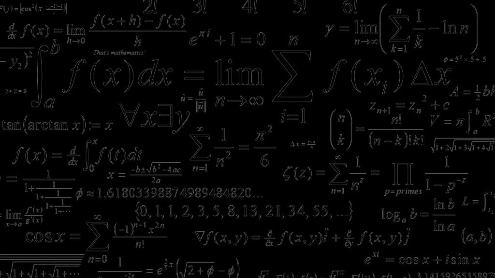

# Math

The project is its own implementation of the math.h library.

* The program developed according to the principles of structured programming
* Implemented as a static library
* The total verifiable accuracy is 16 significant digits
* Verifiable accuracy of the fractional part is up to 6 decimal places
* The library includes functions such as:
  + abs(computes absolute value of an integer value)
  + acos(computes arc cosine)
  + asin(computes arc sine)
  + atan(computes arc tangent)
  + ceil(returns the nearest integer not less than the given value)
  + cos(computes cosine)
  + exp(returns e raised to the given power)
  + fabs(computes absolute value of a floating-point value)
  + floor(returns the nearest integer not greater than the given value)
  + fmod(remainder of the floating-point division operation)
  + log(computes natural logarithm)
  + pow(raises a number to the given power)
  + sin(computes sine)
  + sqrt(computes square root)
  + tan(computes tangent)

***

This project was developed by a students of School 21: tszechwa, jsharika, mugroot
